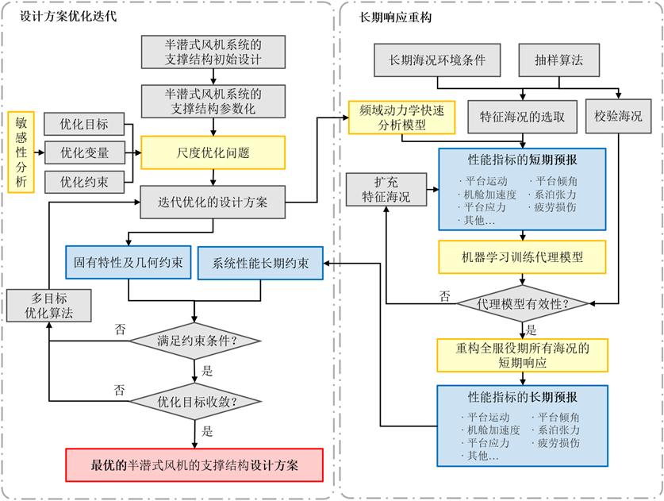
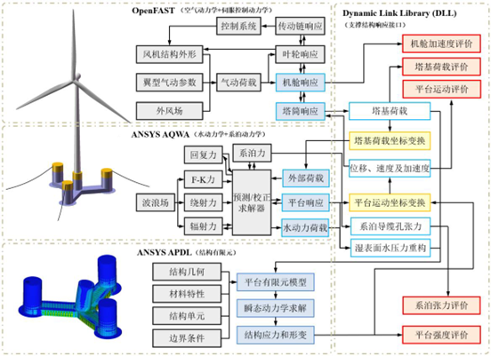
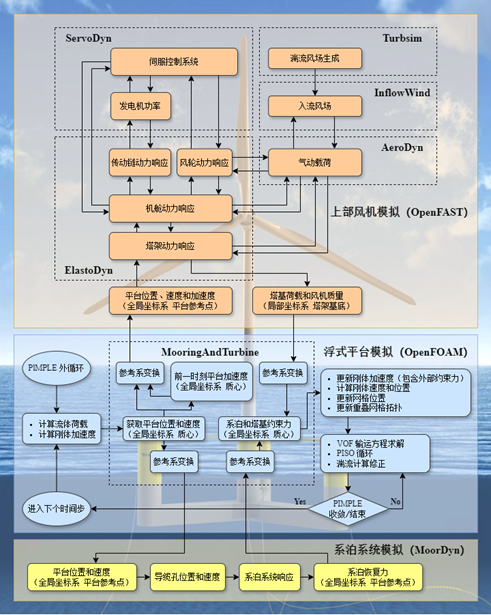

海上风电
==========

1. 浮式风机基础的主尺寸优化
-----------------------------

   浮式风机基础的主尺寸优化

2. 浮式风机混凝土基础的结构设计与优化
----------------------------------------

   混凝土结构浮式风机基础结构的设计与优化

3. 浮式风机系统多物理场多体动力学分析模型
-------------------------------------------

4. 浮式风机系统的运动和振动控制
-------------------------------

.. autosummary::
   :toctree: generated

   lumache
